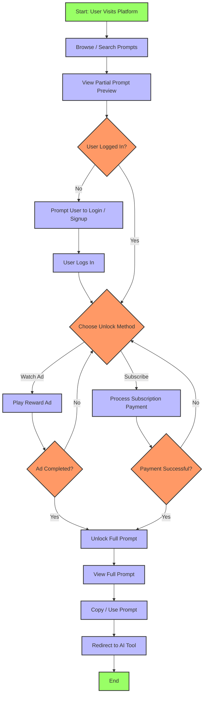

```mermaid

flowchart TD

    A[Start: User Visits Platform] --> B[Browse / Search Prompts]
    B --> C[View Partial Prompt Preview]

    C --> D{User Logged In?}

    D -->|No| E[Prompt User to Login / Signup]
    E --> F[User Logs In]
    F --> G{Choose Unlock Method}

    D -->|Yes| G

    G -->|Watch Ad| H[Play Reward Ad]
    H --> I{Ad Completed?}

    I -->|No| G
    I -->|Yes| J[Unlock Full Prompt]

    G -->|Subscribe| K[Process Subscription Payment]
    K --> L{Payment Successful?}

    L -->|No| G
    L -->|Yes| J

    J --> M[View Full Prompt]
    M --> N[Copy / Use Prompt]
    N --> O[Redirect to AI Tool]

    O --> P[End]

%% Classes
class A,P startEnd;
class B,C,E,F,H,J,K,M,N,O step;
class D,G,I,L decision;

%% Styles
classDef startEnd fill:#9f6,stroke:#333,stroke-width:2px;
classDef step fill:#bbf,stroke:#333,stroke-width:2px;
classDef decision fill:#f96,stroke:#333,stroke-width:2px;

```