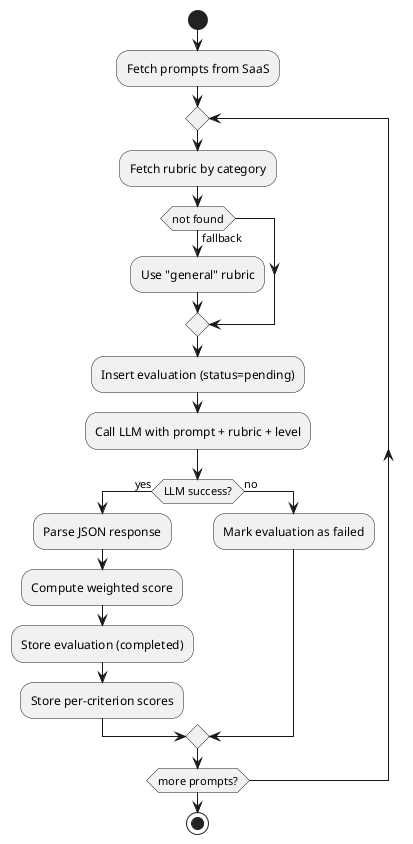

Here is your **final, clean, implementation-ready Method (Evaluation System Only)**—rewritten so you can hand it directly to a coding agent.

---

# 🧠 Method (Evaluation System Only)

## 🏗️ Architecture Overview

The evaluation system is a **decoupled module** that integrates with your existing SaaS.

```plantuml
@startuml
actor "Main SaaS Backend" as App

App --> Evaluation Worker : provide prompts
Evaluation Worker --> DB : store results
Evaluation Worker --> LLM API : grading

Scheduler --> Evaluation Worker : trigger (24h)
@enduml
```

### Components

* **Evaluation Worker**

  * Core grading logic
  * Runs batch evaluations
* **Scheduler (Cron)**

  * Triggers evaluation every 24 hours
* **Database**

  * Stores rubrics + evaluation results
* **LLM API**

  * Performs scoring + feedback generation

---

## 🗃️ Database Schema

### 1. evaluations

```sql
CREATE TABLE evaluations (
  id UUID PRIMARY KEY,
  prompt_id UUID NOT NULL,
  category TEXT NOT NULL,
  level TEXT NOT NULL, -- starter | builder | pro | super

  overall_score FLOAT NOT NULL,
  overall_feedback TEXT,

  rubric JSONB NOT NULL, -- snapshot of rubric used

  status TEXT DEFAULT 'completed', -- pending | completed | failed

  created_at TIMESTAMP DEFAULT NOW()
);
```

---

### 2. evaluation_scores

```sql
CREATE TABLE evaluation_scores (
  id UUID PRIMARY KEY,
  evaluation_id UUID REFERENCES evaluations(id),

  criterion_name TEXT NOT NULL,
  score FLOAT NOT NULL,
  feedback TEXT
);
```

---

### 3. rubrics

```sql
CREATE TABLE rubrics (
  id UUID PRIMARY KEY,
  category TEXT UNIQUE NOT NULL,
  criteria JSONB NOT NULL,

  created_at TIMESTAMP DEFAULT NOW()
);
```

### Example `criteria`

```json
[
  {"name": "clarity", "weight": 0.4},
  {"name": "structure", "weight": 0.3},
  {"name": "seo", "weight": 0.3}
]
```

---

## ⚙️ Evaluation Flow



---

## 🤖 LLM Evaluation Design

### Model Configuration

* `temperature = 0`
* `top_p = 1`

---

### Prompt Template

```text
You are a strict prompt evaluator.

Prompt Level: {{level}}  (starter | builder | pro | super)

Evaluation Guidelines:
- Starter: reward simplicity and usability
- Builder: reward structure and clarity
- Pro: reward optimization and specificity
- Super: reward completeness and robustness

Scoring Guide:
1-3 = poor
4-6 = average
7-8 = good
9-10 = excellent

Instructions:
- Score relative to the level (not absolute perfection)
- Be consistent across evaluations
- The same prompt should receive the same score if evaluated again
- Return ONLY valid JSON

PROMPT:
{{prompt_content}}

CRITERIA:
{{criteria_json}}

OUTPUT FORMAT:
{
  "scores": [
    {"name": "clarity", "score": 8, "feedback": "..."},
    {"name": "structure", "score": 7, "feedback": "..."}
  ],
  "overall_feedback": "..."
}
```

---

## 🧮 Scoring Algorithm (Backend नियंत्रित)

Compute score deterministically:

```text
overall_score = Σ(score_i × weight_i)
```

### Rules

* Do NOT trust LLM for final score
* Always compute in backend
* Round to 1 decimal (optional)

---

## ⏱️ Scheduling Strategy

* Run evaluation job every **24 hours**
* Only evaluate:

  * new prompts
  * updated prompts

### Suggested Logic

```sql
SELECT * FROM prompts
WHERE updated_at > last_evaluation_time;
```

---

## 🔁 Idempotency Strategy

Ensure **one evaluation per prompt (latest only)**

```sql
DELETE FROM evaluations WHERE prompt_id = :prompt_id;
```

Then insert fresh evaluation.

---

## ⚠️ Failure Handling

* Retry LLM call up to **3 times**
* If still fails:

  * mark `status = failed`
  * log error

---

## 🔍 Validation Rules

Reject LLM response if:

* Missing criteria
* Invalid JSON
* Score not in range (1–10)

👉 Never store partial or invalid evaluations

---

## 🧠 Rubric Resolution Logic

```text
if rubric exists for category:
    use it
else:
    use "general" rubric
```

---

## 🧩 Integration Contract (Minimal)

### Input to evaluation system

```json
{
  "prompt_id": "uuid",
  "content": "...",
  "category": "blog",
  "level": "starter"
}
```

---

### Output (stored, not computed on request)

```json
{
  "overall_score": 8.2,
  "criteria": [
    {"name": "clarity", "score": 8, "feedback": "..."}
  ],
  "feedback": "..."
}
```

---

## 🔑 Key Design Decisions

* ✅ Decoupled evaluation module
* ✅ LLM-based scoring (deterministic setup)
* ✅ Category-based rubrics (DB-driven)
* ✅ Level-aware grading (contextual, not structural)
* ✅ Backend-controlled scoring (not LLM)
* ✅ Single latest evaluation per prompt (MVP)

---

## 🚫 Explicit Non-Goals (MVP)

* No user ratings
* No rubric versioning
* No multi-model evaluation
* No real-time grading
* No historical comparisons

---

## ✅ Outcome

This system ensures:

* consistent scoring
* explainable results
* category-aware evaluation
* level-aware fairness
* easy integration into your existing SaaS

---

