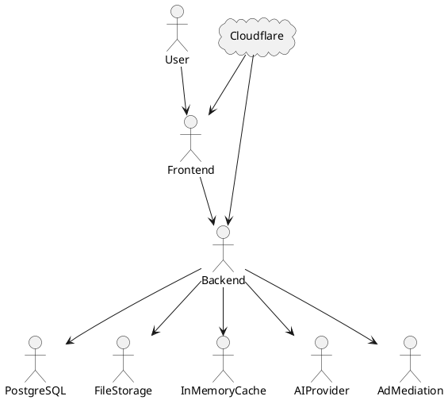
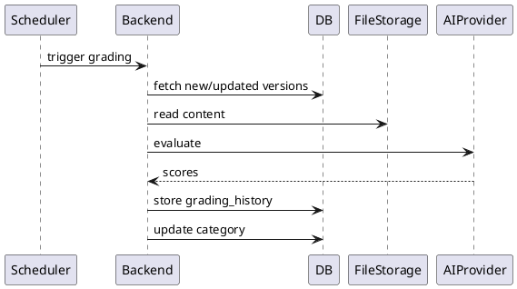

# SPEC-1-SuperPrompt Architecture

## Background

SuperPrompt is a web-based platform that enables users to discover, unlock, and utilize high-quality AI prompts through a hybrid monetization model.

The platform starts with a few hundred curated prompts and scales gradually to thousands of users and prompts. Core capabilities include browsing prompts without login, unlocking prompts via reward-based ads, subscription-based access, and a scheduled AI-driven grading system.

The system is web-first, optimized for low cost, high read performance, and incremental scalability.

Core value loop:
Discovery → Login → Unlock → Copy → Use

---

## Requirements

### Must Have

* Browse prompts without login (partial preview)
* Unlock prompts via reward ads (per-prompt, permanent unlock)
* Subscription-based unlimited access
* Prompt categorization and versioning
* AI grading system (scheduled + manual trigger)
* Authentication (email + OAuth)

### Should Have

* Search (title/tags) and filtering
* User ratings
* Creator submissions
* Basic admin interface

### Non-Functional

* <2s load time
* 99.5% uptime
* Support up to ~50K users

---

## UI/UX Implementation

### Header/Navbar
- Fixed position at top, centered horizontally
- Circular pill shape with black background
- Responsive logo (full logo on desktop, small logo on mobile)
- Theme toggle, user profile, logout, login/register buttons

### Bottom Search Bar
- Fixed position at bottom, centered horizontally
- 700px max-width with gradient border (Framer-style purple gradient)
- 3-row layout:
  1. Applied filters row (visible when filters active)
  2. Search input + Date/Tier dropdowns
  3. Horizontally scrollable category chips with arrow navigation
- Categories displayed in uppercase

### Prompt Cards
- CSS Grid layout with responsive columns (auto-fill, minmax 380px)
- Theme-consistent styling (all light in light mode, all dark in dark mode)
- No alternating pattern

### Login/Register Pages
- Inline component definitions to avoid SSR import issues
- OAuth buttons with inline SVG icons
- Email/password login form

---

## Method

### High-Level Architecture



---

### Components

#### Frontend (Next.js)

* Hosted on Vercel/Cloudflare Pages
* SSR/CSR
* Calls backend APIs
* Key components:
  - Header (navbar)
  - BottomSearchBar (search + filters)
  - PromptCard (prompt display)
  - CircularScore (grading score)

#### Backend (NestJS Monolith)

Modules:

* Auth (BetterAuth)
* Prompt
* Unlock/Entitlement
* Subscription (Stripe)
* Ratings
* Tier (offline pipeline — data in `prompts.complexity_tier`)
* Ad Mediation Adapter
* Cache
* Admin

#### Database (PostgreSQL + Drizzle)

* Source of truth for all metadata and transactions

#### File Storage (Local → S3 later)

* Stores prompt content as Markdown

#### In-Memory Cache

* Map-based cache for shared, non-user-specific data
* TTL: 5–15 minutes

---

### File Storage Contract

```
/prompts/{promptId}/
  v1/
    starter.md
    builder.md
    pro.md
    super.md
  v2/
    starter.md
    ...
```

Rules:

* DB stores base path + version
* Backend composes file path per version
* Versioning is immutable (new version created on update)

---

### Database Schema (Drizzle-Oriented)

```sql
users(
  id uuid pk,
  email text unique,
  password_hash text,
  created_at timestamptz
)

sessions(
  id uuid pk,
  user_id uuid,
  expires_at timestamptz
)

prompts(
  id uuid pk,
  title text,
  category text,
  base_path text,
  current_version int,
  is_multi_version boolean,
  created_at timestamptz
)

prompt_versions(
  id uuid pk,
  prompt_id uuid,
  version_number int,
  created_at timestamptz
)

prompt_version_files(
  id uuid pk,
  prompt_version_id uuid,
  level text, -- starter|builder|pro|super
  file_name text
)

ratings(
  id uuid pk,
  user_id uuid,
  prompt_id uuid,
  rating int,
  created_at timestamptz,
  unique(user_id, prompt_id)
)

unlocks(
  id uuid pk,
  user_id uuid,
  prompt_id uuid,
  unlocked_via text,
  created_at timestamptz,
  unique(user_id, prompt_id)
)

subscriptions(
  id uuid pk,
  user_id uuid,
  status text,
  expires_at timestamptz
)

grading_jobs(
  id uuid pk,
  status text,
  triggered_by text, -- system|admin
  created_at timestamptz
)

grading_history(
  id uuid pk,
  prompt_version_id uuid,
  score jsonb,
  created_at timestamptz
)
```

---

### API Design (Frontend ↔ Backend)

> **Note**: All API endpoints are prefixed with `/api/v1/` (versionable via `API_VERSION` env var)

#### Auth

* POST /api/v1/auth/register
* POST /api/v1/auth/login
* POST /api/v1/auth/logout
* GET /api/v1/auth/me
* GET /api/v1/auth/me/state (returns subscription, unlocks, ratings)

#### Prompts

* GET /api/v1/prompts?category=&search=&page=&limit=&fields=&sort=
* GET /api/v1/prompts/:slug
* GET /api/v1/prompts/:slug/preview
* GET /api/v1/prompts/:slug/version/:v
* GET /api/v1/prompts/:slug/related
* GET /api/v1/prompts/categories
* GET /api/v1/prompts/tags

#### Prompt Versioning

* POST /api/v1/prompts (create v1) - requires auth
* PUT /api/v1/prompts/:id (creates new version vN+1) - requires auth

#### Unlock

* POST /api/v1/prompts/:id/unlock
* POST /api/v1/ads/callback

#### Subscription (Billing)

* POST /api/v1/billing/checkout
* GET /api/v1/billing/status
* POST /api/v1/billing/webhook (Stripe webhook)

#### Ratings

* POST /api/v1/prompts/:id/rate

#### Admin

* GET /api/v1/admin/prompts?status=pending
* POST /api/v1/admin/prompts/:slug/approve
* POST /api/v1/admin/prompts/:slug/reject

#### Health Checks (unversioned)

* GET /health - full status with uptime
* GET /health/ready - readiness probe
* GET /health/live - liveness probe

---

#### Query Parameters

| Parameter | Description | Example |
|-----------|-------------|---------|
| `fields` | Comma-separated fields to return | `?fields=title,slug,tier` |
| `sort` | Sort field:direction | `?sort=views:desc` |
| `tier` | Filter by complexity tier | `?tier=pro` |
| `page` | Page number | `?page=2` |
| `limit` | Results per page | `?limit=20` |

---

### Ad Mediation Abstraction

```ts
interface AdProvider {
  loadAd(): Promise<AdToken>
  verifyCompletion(token: string): Promise<boolean>
}
```

---

### Entitlement Logic

Access = TRUE if:

* active subscription
  OR
* unlock exists

---

### In-Memory Cache Strategy

Cache keys:

* `prompts:list:p{page}:l{limit}:c{category}:s{search}:t{tier}` - paginated list
* `prompts:detail:{slug}` - single prompt
* `prompts:categories` - all categories
* `user:state:{userId}` - user state (subs, unlocks, ratings)

**Cache Tags** (for selective invalidation):
* `prompts` - all prompt-related caches
* `categories` - category caches
* `user` - user state caches
* `catalog` - catalog listing caches

**Invalidation Methods**:
* `invalidatePromptsList()` - bust all list caches
* `invalidatePromptDetail(slug)` - bust single prompt cache
* `invalidateCategories()` - bust category caches
* `invalidateUserState(userId)` - bust user state cache
* `invalidateByTags(tags[])` - bust by tags

Never cache user-specific data except via explicit state endpoint.

---

### Error Response Format

All errors return a consistent JSON format:

```json
{
  "code": "NOT_FOUND",
  "message": "Prompt with slug 'xyz' not found",
  "details": {},
  "timestamp": "2026-05-13T12:00:00Z",
  "path": "/api/v1/prompts/xyz",
  "requestId": "uuid-v4"
}
```

**Error Codes**:
* `BAD_REQUEST` - 400
* `UNAUTHORIZED` - 401
* `FORBIDDEN` - 403
* `NOT_FOUND` - 404
* `CONFLICT` - 409
* `UNPROCESSABLE_ENTITY` - 422
* `RATE_LIMIT_EXCEEDED` - 429
* `INTERNAL_SERVER_ERROR` - 500

**Custom Exceptions**:
* `PromptNotFoundException`
* `CategoryNotFoundException`
* `InsufficientPermissionException`
* `PaymentRequiredException`
* `UserAlreadyExistsException`
* `InvalidCredentialsException`
* `SubscriptionRequiredException`
* `UnlockAlreadyExistsException`
* `RateLimitExceededException`
* `InvalidStripeSignatureException`

---

### Interceptors & Logging

**Logging Interceptor** (global):
- Logs all HTTP requests/responses
- Sanitizes sensitive data (passwords, tokens)
- Includes request ID for tracing
- Logs: method, url, status, duration

**Response Format**:
- Wraps responses in `{ data, meta }` structure (opt-in)
- Meta includes: requestId, timestamp, pagination

---

### AI Grading Pipeline (Scheduled + Manual)

Trigger:

* Runs every 24 hours
* Only processes:

  * new prompts
  * updated prompt versions

Also supports:

* Manual trigger via admin API

Flow:



---

## Implementation

1. Setup monorepo (frontend + backend)
2. Setup Oracle VM
3. Install PostgreSQL
4. Setup NestJS + Drizzle + BetterAuth
5. Implement auth + session
6. Implement prompt + versioning system
7. Implement file storage layer
8. Implement unlock + ad adapter
9. Integrate Stripe
10. Add in-memory cache
11. Implement grading scheduler + manual trigger
12. Build basic admin APIs/UI
13. Deploy frontend

---

## Milestones

1. Core (browse + auth + prompts)
2. Monetization (ads + subscription)
3. Versioning + grading
4. Admin + optimization

---

## Gathering Results

* DAU
* Unlock rate
* Conversion rate
* Prompt engagement
* Grading consistency

---

| Layer         | Choice                       |
| ------------- | ---------------------------- |
| Framework     | Next.js ✅                    |
| Styling       | Tailwind CSS ✅               |
| UI Components | shadcn/ui ✅                  |
| State         | React Query (TanStack Query) |
| Forms         | React Hook Form              |
| Auth client   | BetterAuth client            |

---

## Environment Variables

| Variable | Description | Default |
|----------|-------------|---------|
| `API_VERSION` | API version prefix | `v1` |
| `PORT` | Server port | `4000` |
| `DATABASE_URL` | PostgreSQL connection string | - |
| `NODE_ENV` | Environment (production/development) | - |
| `CORS_ORIGIN` | Allowed CORS origins | FRONTEND_URL or localhost:3000 |

Frontend uses `NEXT_PUBLIC_API_VERSION` to match backend.
